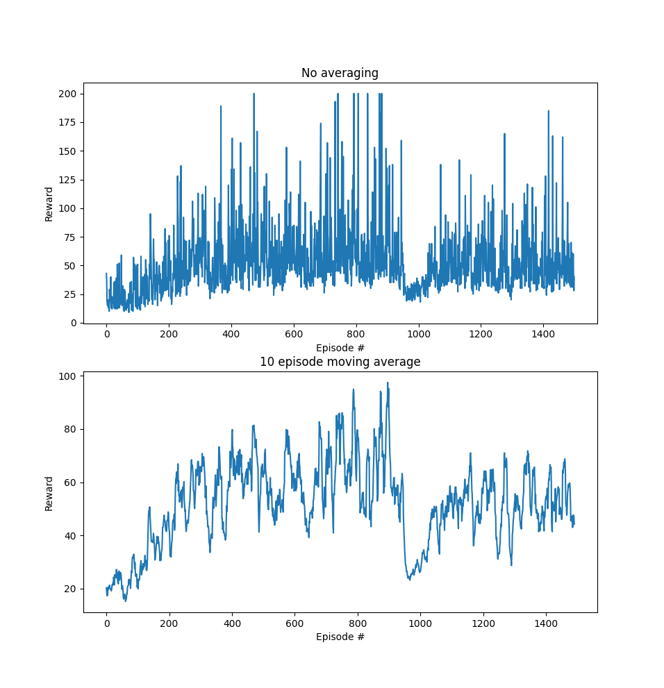

OpenAI Gym
=========

Here I attempt to tackle the puzzles in OpenAI gym using a variety of machine learning techniques.

## Terms
- Observation: what the agent, in this case machine learning models, sees from the environment
- Action: something the agent does to the environment
- Agent: something that takes observations and outputs actions. I also call this a 'model'
- Episode: a series of actions/observations

Reinforcement learning is based around seeing how an agent performs in an episode, seeing the reward it gets, and updating the agent so the it receives more reward.

### Simple Reinforcement Learning

The basic concept is that during an episode, I sample actions and save the observation/action pairs. After the episode is over, I check the received reward. If the reward is greater than the rewards seen in previous episodes, I update the gradients on the model so that every action taken in the episode is slightly more likely to be taken by the model during the next episode, given the same observation. If the reward is less, I update the gradients so that the opposite happens.

In technical terms, I update model gradients using backpropagation with a multiplier associated with the difference in reward.

Even though in the beginning this update strategy may encourage suboptimal or damaging actions, in the long run the accumulation of actions will average out and the worse actions will be disincentivized.

Current results on Cartpole v1:

